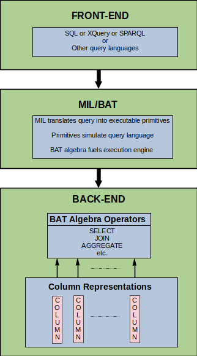
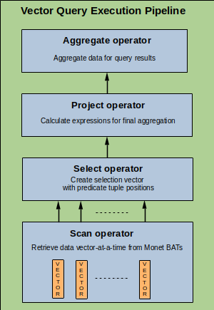

# col-tech-drft2.md  

Column-store techniques article for Medium  

Image credit:

Hutsch:
(Selected)
Photo by <a href="https://unsplash.com/@heysupersimi?utm_content=creditCopyText&utm_medium=referral&utm_source=unsplash">Simone Hutsch</a> on <a href="https://unsplash.com/photos/blue-and-yellow-curtain-wall-building-during-daytime-eXBqaHUt994?utm_content=creditCopyText&utm_medium=referral&utm_source=unsplash">Unsplash</a>
  

Niks
Photo by <a href="https://unsplash.com/@hertwashere?utm_content=creditCopyText&utm_medium=referral&utm_source=unsplash">Hert Niks</a> on <a href="https://unsplash.com/photos/low-angle-photography-of-brown-concrete-building-yccGbJ5alCg?utm_content=creditCopyText&utm_medium=referral&utm_source=unsplash">Unsplash</a>
  

# Advanced Architectural Techniques that Power Today's Column-store Databases  

## Introduction  

Advanced architectural techniques and modern CPUs enable the dramatic database query performance improvements required to meet the demands of today's **data analytics applications** like AI, machine learning, data mining, and business intelligence. Traditional relational database management systems (DBMS) were designed in the late 1950s when CPUs, memory, and storage were far more limited than today's hardware.  

Even with the performance and capacity improvements that today's hardware offers, **traditional relational databases** are unable to take advantage of these improvements given their architectural constraints. Data analysts might appreciate learning about some of the techniques applied in modern databases to accelerate query execution for data analytics applications.  

## Column-store  

Traditional relational databases were designed for **record-at-a-time** transactions such as sales or banking applications called online transaction processing (**OLTP**). These databases consist of tables where each record is stored as a row (**row-store**), and the columns are attributes of each row. Transactions focus more on selective rows in a table. Data analytics applications&mdash;online analytics processing (**OLAP**)&mdash;focus more on selective columns and many rows of a table. To address these needs, new column-oriented databases that vertically partition the database have evolved.   

These new column-oriented database architectures that store columns instead of rows, are referred to by multiple names including "column-oriented", "columnar", and "column-store". These names are sometimes used interchangeably. For this article, I will refer to them as **column-store**.  

  
Figure 1. Row vs. column tuples in traditional row-store databases and column-store databases.  

## Advanced techniques  

Data analytics databases can reach sizes in the terabytes range, thus the need for speed and capacity. Today's advanced architectural techniques can leverage faster **CPUs**, large fast **cache** memory, and higher capacity disks to accelerate query execution. Some of the techniques that have been developed and commercialized include:  

* Column-at-a-time query processing  
* Column-specific compression  
* Late materialization  
* Vectorization  
* Hybrid row/column implementation  
* Efficient loading  
* Database cracking and adaptive indexing  

## Column-at-a-time query processing  

Row-store databases process queries one record (row) at a time. To execute a query on a column of data, the DBMS must read multiple rows, extract data from the relevant column attributes, reconstruct (**materialize**) that data into a column tuple, then [evaluate the query predicates](https://medium.com/@jcofield2.0/predicate-logic-the-magic-roots-of-relational-database-management-systems-4d7eabf1ad9f). A more efficient way is to skip the row-by-row materialization (**early materialization**) and operate directly on the column data.  

One of the pioneer implementations of **column-at-a-time query processing** was the MonetDB DBMS. MonetDB developed new column operators to perform operations like `SELECT`, `AGGREGATE`, and `JOIN`. These operators&mdash;implemented as a simplified set of memory-mapped operators&mdash;eliminated predicate interpretation overhead from inside the operator code. By delaying materialization until later in the query execution process, fewer materialization steps are performed, significantly improving query speed.  

  
Figure 2. Column-at-a-time query process in MonetDB architecture.  

## Column-specific compression  

Because of the massive amounts of data typical of analytic databases, compression techniques are often used. Beyond the obvious file size reduction, CPU performance and data transfer time are also improved.  With compression, more data can be loaded into and executed from cache memory. I/O speed is improved during the query process as  less time is spent transferring data between disk, memory, and CPU.  

Since traditional query optimizers operate on uncompressed data, processing compressed columns in a traditional query pipeline would introduce undesirable delays and **wasted CPU cycles** in compressing and decompressing data through the query pipeline. The C-Store DBMS implemented operators that operate on both compressed and uncompressed columns. [2]  

## Late materialization  

To materialize data for a single column, each row must be scanned, the attribute of interest located within the record, and the collection of attributes reconstructed a tuple at a time. Several operations are serially executed in the query pipeline which requires tuple-at-a-time interpretation. Delaying materialization until late in the query process eliminates the overhead incurred if it is done for each operation. Some row-store databases spend as much as [**90% of the query time in tuple-at-a-time interpretation**.](https://www.researchgate.net/profile/Niels-Nes/publication/45338800_MonetDBX100_Hyper-Pipelining_Query_Execution/links/0deec520cd1e8a3607000000/MonetDB-X100-Hyper-Pipelining-Query-Execution.pdf)  

## Vectorization  

Another technique that uses a combination of column-at-a-time and tuple-at-a-time techniques is vectorization. This technique was developed for the MonetDB DBMS, in the X100 project (later called VectorWise). The X100 project sought to further improve query performance by **taking advantage of CPU cache memory** improvements and developing a new vector data structure. A vector is comprised of multiple tuples, where vector operators process **N-tuples-at-a-time**. (See Figure 3.) Vector operators execute queries in a vector-at-a-time pipeline similar to a tuple-at-a-time pipeline, but with increased bandwidth.  

  
Figure 3. Vector operators in the query pipeline.  

## Hybrid row/column implementation  

Column-store architectures are read-optimized because OLAP applications tend to be read-mostly where the frequency of write operations is relatively rare. As a result, column-stores are slower than row-stores for write operations which are typically performed as batch operations, and not in real time.  

Slower write performance is especially problematic for **inserts and updates**. The common solution is to design the architecture with separate write-store and read-store components. The write-store component can be much smaller because it is used less frequently, minimizing overhead. It can either be designed like a horizontally partitioned row-store or like a vertically partitioned column-store.  

**Vertical partitions.** MonetDB took a vertically partitioned "difference" approach, adding two auxiliary  columns&mdash;one for inserts, one for deletes&mdash;and merging the changes. [1]  

**Horizontal partitions.** C-Store, implemented a horizontally partitioned write-store, connected by a tuple mover that performs batch updates from the write-store to the read-store. [2]  

**PDT.** VectorWise introduced a new data structure called a positional delta tree (PDT). A PDT is like a B-tree but includes additional differential update information. A B-tree data structure is commonly used for searching and sorting databases. It is appealing because it combines speed and simplicity. The PDT data structure improves performance over the B-tree data structure. [4]  

## Efficient loading  

**Data warehouses.** Commercial data warehousing is an example of a popular commercial application that significantly benefits from hybrid row/column architectures. Data warehouses are at the last stage of the extract, transform, load (ETL) data pipeline. Data is typically bulk-loaded to a warehouse for subsequent analytic processing.  
 
The previously mentioned hybrid architectures are perfectly suited for data warehousing applications. The write-optimization techniques employed in hybrid row/column architectures and indexing (discussed later) make **bulk loading and updates** more efficient.  

## Database cracking and adaptive indexing  

For most databases, the [lowest level of database access is the table scan](https://www.cidrdb.org/cidr2005/papers/P18.pdf). Performance can be improved by reducing the amount of data to be scanned. By **dividing database tables into smaller chunks (cracking)**, a query optimizer can eliminate irrelevant data. Database cracking techniques use queries to intelligently divide the database into smaller chunks, making table scans more efficient by focusing on relevant data. [5]  

Indexing is critical to database search and sort performance during query execution. Using the [B-tree and PDT data structures for indexing](https://dl.acm.org/doi/abs/10.1145/1807167.1807227) speeds up scans by eliminating data that is irrelevant to a query. [4]  

Indexes are traditionally determined before query execution, prohibiting on-the-fly tuning. **Adaptive indexing allows the query engine to learn** from previous queries and "autonomously create only the indexes it needs" [1], minimizing the CPU cycles spent on irrelevant data.  

## References  

[1] Abadi, D., Boncz, P., Harizopoulos, S., Idreos, S., & Madden, S. (2013). "The design and implementation of modern column-oriented database systems." Foundations and Trends® in Databases, 5(3), 197-280., https://stratos.seas.harvard.edu/files/stratos/files/columnstoresfntdbs.pdf  

[2] Stonebraker, Mike, Daniel J. Abadi, Adam Batkin, Xuedong Chen, Mitch Cherniack, Miguel Ferreira, Edmond Lau et al., “C-Store: A Column-oriented DBMS”, Proceedings of the 31st VLDB Conference, Trondheim, Norway, 2005, https://dl.acm.org/doi/abs/10.1145/3226595.3226638, (https://web.stanford.edu/class/cs345d-01/rl/cstore.pdf)  

[3] Boncz, Peter A., Marcin Zukowski, and Niels Nes. "MonetDB/X100: Hyper-Pipelining Query Execution." In *Cidr*, vol. 5, pp. 225-237. 2005., https://www.researchgate.net/profile/Niels-Nes/publication/45338800_MonetDBX100_Hyper-Pipelining_Query_Execution/links/0deec520cd1e8a3607000000/MonetDB-X100-Hyper-Pipelining-Query-Execution.pdf  

[4] Héman, Sándor, Marcin Zukowski, Niels J. Nes, Lefteris Sidirourgos, and Peter Boncz. "Positional update handling in column stores." In Proceedings of the 2010 ACM SIGMOD International Conference on Management of data, pp. 543-554. 2010.,https://dl.acm.org/doi/abs/10.1145/1807167.1807227  

[5] Kersten, Martin L., and Stefan Manegold. "Cracking the database store." In CIDR, vol. 5, pp. 4-7. 2005. https://www.cidrdb.org/cidr2005/papers/P18.pdf  

### End  
