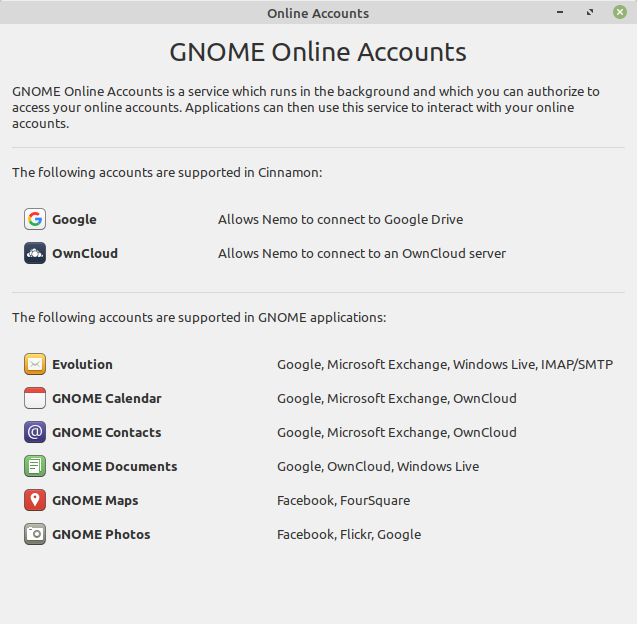
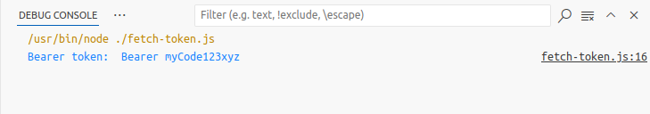

# diysvr-draft1.md  

## DIY Token Server Article Notes  

  

This article is intended as a basic tutorial on how authorization tokens are used in REST APIs. To model the authorization flow, I will use JavaScript to create a simple token server to demonstrate the flow.  

In this article, you will learn how to create a token server in JavaScript. The token server will be a local http server that will send a token to a client-side REST API.  

<a title="Devansvd, CC BY-SA 4.0 &lt;https://creativecommons.org/licenses/by-sa/4.0&gt;, via Wikimedia Commons" href="https://commons.wikimedia.org/wiki/File:Abstract-flow.png"></a>  
Source: Devansvd, CC BY-SA 4.0 <https://creativecommons.org/licenses/by-sa/4.0>, via Wikimedia Commons  

Figure 1. Abstract authorization flow.  

## Cloud APIs  

Many cloud-based applications today use REST APIs [DIYSVR-11] to authenticate user identities and control access. Authentication and authorization protocols are required to ensure that data and privacy security. Authentication focuses on verifying identity, while authorization focuses on access to resources. This article focuses on authorization, however, it is worth taking a moment to how authentication and authorization work together as complementary security processes.  

Cloud applications typically require a login and password to access private resources like secure databases. If you deploy multiple applications to access your databases, you use your login ID and password for each application.  Authentication servers are responsible for verifying your identity. They don’t automatically authorize permission to access your database. That is the role of an authorization server.  

In an authorization flow, your authorization server checks with your authentication server to verify your identity before granting database access. A JSON web token (JWT) is commonly used by authorization servers to confirm authentication.  

In this article, you will learn about the principles of token servers with code snippets of a simple JavaScript token server.  

## Authorization tokens  

Security is a critical issue in cloud computing. It is necessary to ensure two critical factors when accessing resources. Those factors are: identity and permission. Identity is confirmed by authentication servers. Permission is confirmed by authorization servers. Authorization servers grant permissions via tokens.  

  
Figure 2. Client app sends token request to authorization server and receives token in response.  

Authorization tokens specify which resources the web application can access, what read, write, and execute permissions are allowed.  Authentication servers typically send JSON web tokens to you, which you then send to your authentication server.  

The OAuth authentication protocol allows you to approve one application interacting with another on your behalf without exposing your password.  

OpenID Connect [DIYSVR-18] authentication functionality is built on top of the OAuth 2.0 framework of specifications (IETF RFC 6749 and 6750).  

## Single sign-on  

Cloud computing has given rise to a proliferation of web applications that require users to create IDs and passwords for each. Single sign-on (SSO) providers offer a solution to this dilemma. SSO technology allows the user to establish their identity via sign-on (login and password), then enable registered apps to verified the user's identity with the SSO provider. The user is not required to create a new sign-on with each app. Instead, the authorization server returns a token that the application uses to access the user's resources.  

OpenID Connect enables SSO providers to offer authentication and authorization services for cloud applications. It is used by many SSO providers, including names like Apple, Google, and Microsoft.  

  
Figure 3. Examples of SSO enabled online applications.  

## Authorization server demonstration code  

Below is an example of a simple token server implemented in JavaScript code. This code will simulate the client application flow.  

**Objective:** Set up nodejs as a token server that can be called from a browser.  

* Set up nodejs server to serve token then use token for a REST API  
* Token will be passed to browser as a variable in localStorage  

**The process:**  

* Create nodejs server “tkserver.js”.  
* Put token in secret file.  
* Browser requests token from server.  
* Browser uses token for another API.  

```
## Source ENV variable   

# Script name: token-setup.src  

myToken=myCode123xyz
export myToken
```

**Run server:**  

`node token_server.js`  

```
http.createServer(function (request, response) {
    response.writeHead(200, {
        'Content-Type': 'text/plain', 
        'Origin': 'http://127.0.0.1:8081/',
        'Access-Control-Allow-Origin': '*',
        'Vary': 'Origin'
    });
    response.end(jsonStr);
}).listen(8081);
```


## Fetch token  

```
// fetch-token.js

import fetch from 'node-fetch';

async function postBlob() {
    const url = "http://localhost:8081/"; 
    try {
      const response = await fetch(url); 
      if (!response.ok) {
        throw new Error(`Response status: ${response.status}`);
      }
      const jsonResp = await response.json();
      var myKey = jsonResp.myKey;
      var bearer_token = 'Bearer ' + myKey
      console.log('Bearer token: ', bearer_token);
    } catch (error) {
      console.error(error.message);
    }
}

postBlob();

```

Figure 4 below shows that the `fetch-token.js` code successfully retrieved the JWT from our mock authorization server.

  
Figure 4. Output in Debug Console shows the JWT key-value pair fetched from the authorization server.  

## Conclusion  

JSON web tokens offer a secure way to manage access authorization over a REST API. Our JavaScript code snippets demonstrate a client authorization flow where a local authentication server responds to a fetch request for a token.  

Delivering tokens by SSO providers benefits both users and developers. Users are relieved of the burden of sending login IDs and passwords to multiple applications without compromising security. Developers are relieved of the security risks associated with managing and storing IDs and passwords for multiple accounts.  


### End  