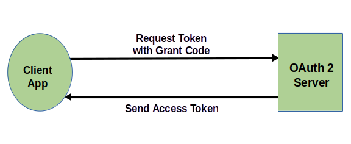

# diysvr-draft2.md  

## DIY Token Server  

  

This article is intended as a basic tutorial on how authorization tokens are used in REST API applications. You will see how you can model the authorization flow using JavaScript code to create a simple token server. The token server will be a local HTTP server that will send a token to a client-side REST API application.  

<a title="Devansvd, CC BY-SA 4.0 &lt;https://creativecommons.org/licenses/by-sa/4.0&gt;, via Wikimedia Commons" href="https://commons.wikimedia.org/wiki/File:Abstract-flow.png"></a>  
Source: Devansvd, CC BY-SA 4.0 <https://creativecommons.org/licenses/by-sa/4.0>, via Wikimedia Commons  

Figure 1. Abstract authorization flow.  

## Cloud APIs  

Many cloud-based applications use REST APIs [DIYSVR-11] to authenticate user identities and control access. Authentication and authorization protocols are required to ensure data and privacy security. While this article focuses on authorization, it is useful to first understand how authentication and authorization work together as complementary security processes.  

Cloud applications typically require a login and password to access private resources like databases containing personal, financial, or proprietary information. If you deploy multiple applications to access your databases, you use your login ID and password for each application. Authentication servers are responsible for verifying your identity. They don’t necessarily authorize permission to access your database. That is the role of an authorization server. In some cases, authentication and authorization are done by the same server.  

In an authorization flow, your authorization server receives an authorization grant from you as the resource owner (or an application that you authorize) to verify your identity before granting database access. A JSON web token (JWT) [DIYSVR-29] is commonly used by authorization servers to confirm authentication as shown in Figure 1.  

Later in this article, you will learn about the principles of token servers with code snippets of a simple JavaScript token server.  

## Authorization tokens  

Security is a critical issue in cloud computing. Two key factors must be addressed when accessing resources: identity and permission. Identity is confirmed by authentication servers. Permission is confirmed by authorization servers, which grant permissions via tokens.  

  
Figure 2. Client app sends a token request to the authorization server and receives a token in response.  

Authorization tokens specify which resources the web application can access, and whether read, write, and/or execute permissions are allowed.  The most commonly used tokens are JSON web tokens [DIYSVR-29]. Authorization servers send JWTs in response to an authorization request, which your client application uses to access your database in this case.  

OAuth 1.0 (IETF RFC 5849) [DIYSVR-30] is an industry standard open protocol that provides a simple yet secure authorization method to approve permissions for one application interacting with another on your behalf, without exposing your password. The current iteration, OAuth 2.0 (IETF RFC 6749) [DIYSVR-28], has been widely adopted by leading internet service providers. Extending the OAuth 2.0 protocol, the OpenID Connect [DIYSVR-18] authentication protocol (IETF RFC 6749 and 6750) enables single sign-on (SSO) providers to offer both authentication and authorization services for cloud applications.  

## Single sign-on  

Cloud computing has given rise to a proliferation of web applications that require users to create IDs and passwords for each. Single sign-on (SSO) providers offer a solution to this dilemma. SSO technology allows the user to establish their identity via sign-on (login and password), then enable registered apps to verify the user's identity with the SSO provider. The user is not required to create a new sign-on with each app. Instead, the authentication server returns a token that grants the requesting client application permission to access specific resources on behalf of the user. Notable SSO providers like Apple, Google, and Microsoft offer OpenID Connect services for online application authorization.  

  
Figure 3. Examples of SSO-enabled online applications.  

## Authorization server demonstration code snippets  

Below is an example of a simple token server implemented in JavaScript code. This code simulates the client application flow. Our objective is to set up a mock authorization server, written in JavaScript, in a Node.js environment. The token server mimics a REST API that responds to a request for an authorization token. In this scenario, an application requests a token for permission to post a blob to a database API. A dummy JWT bearer token [DIYSVR-31] will be returned in an HTTP response to the request. Finally, the value of the token will be displayed.  

**The process:**  

* Create a Node.js server `tkserver.js`.  
* Assign a token value to an environment variable.  
* Client app requests a token from the server.  
* Client app uses token for a target API.  

```
## Source ENV variable   

# Script name: token-setup.src  

myToken=myCode123xyz
export myToken
```

**Next: Run server from command line.**  

`node token_server.js`  

**JavaScript code:**

```
http.createServer(function (request, response) {
    response.writeHead(200, {
        'Content-Type': 'text/plain', 
        'Origin': 'http://localhost:8081/',
        'Access-Control-Allow-Origin': '*',
        'Vary': 'Origin'
    });
    response.end(jsonStr);
}).listen(8081);
```


## Fetch token application  

```
// fetch-token.js

import fetch from 'node-fetch';

async function postBlob() {
    const url = "http://localhost:8081/"; 
    try {
      const response = await fetch(url); 
      if (!response.ok) {
        throw new Error(`Response status: ${response.status}`);
      }
      const jsonResp = await response.json();
      var myKey = jsonResp.myKey;
      var bearer_token = 'Bearer ' + myKey
      console.log('Bearer token: ', bearer_token);
    } catch (error) {
      console.error(error.message);
    }
}

postBlob();

```

As the debug console shows in Figure 4, the `fetch-token.js` code successfully retrieved the JWT from our mock authorization server.

  
Figure 4. Output in Debug Console shows the JWT key-value pair fetched from the authorization server.  

## Conclusion  

JSON web tokens offer a secure way to manage access authorization over a REST API. Our JavaScript code snippets demonstrate a client authorization flow where a local authorization server responds to a fetch request for a token.  

Delivering tokens by SSO providers benefits both users and developers. Users are relieved of the burden of sending login IDs and passwords to multiple applications without compromising security, and developers are relieved of the security risks associated with managing and storing IDs and passwords for multiple accounts.  

## References  

[DIYSVR-11], https://medium.com/@jcofield2.0/rest-apis-drive-business-tools-e046317b11d4  
[DIYSVR-29], https://datatracker.ietf.org/doc/html/rfc7519  
[DIYSVR-30], https://datatracker.ietf.org/doc/html/rfc5849  
[DIYSVR-28], https://datatracker.ietf.org/doc/html/rfc6749  
[DIYSVR-18], https://openid.net/developers/discover-openid-and-openid-connect/  
[DIYSVR-31], https://datatracker.ietf.org/doc/html/rfc6750  


### End  