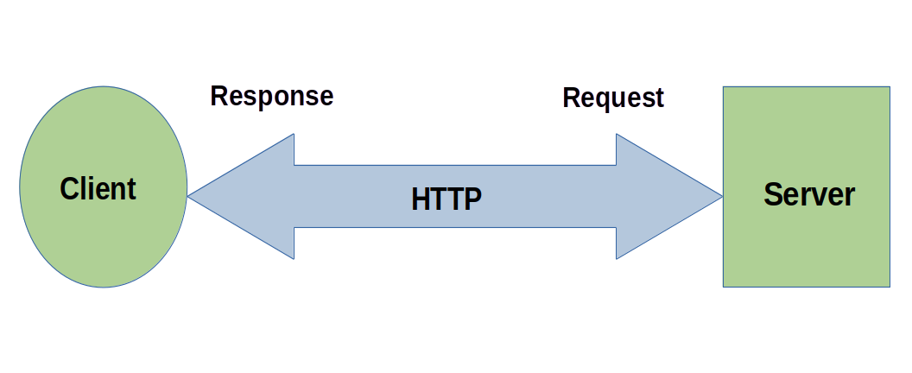
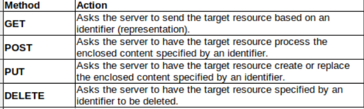

# Music Database REST APIs

## Overview

If you are a developer who wants to integrate network-based services into your applications, an application programming interface (API) is a frequently used solution. An API allows your client application to interact with a server using a common interface. (Figure 1) Network-base APIs are becoming increasingly popular for web applications in industries such as banking, e-commerce, internet of things (IoT), and music.  

Many network-based web services offer APIs that comply with the REpresentational State Transfer (REST) design style which is defined by a set of constraints that I will explain later in this article. APIs that comply with REST constraints are called RESTful. REST APIs operate in two modes, request and response. The client sends a request to the server for data, and the server responds with a status code, and if appropriate, the requested data.

In this article, you will see how you can access a RESTful API database with Python. We will deconstruct the data sent by the client to the server, and the corresponding response received by the client from the server. To illustrate the mechanics of the process, we will use a Python HTTP module to connect to a RESTful music database API.



Figure 1. Client-server model

## Why REST?

A RESTful API allows the client to retrieve data from the server without the need to know details about the server back-end implementation. There is no need for the client to know which server or database management software is being used. In addition, the API enhances security by restricting who can access data and selectively restricting which data can be accessed.

In a RESTful web service, requests made to a resource's URI elicit a response with a payload formatted in HTML, XML, JSON, or some other format. The most common protocol for these requests and responses is HTTP, which provides operations (HTTP methods) such as GET, POST, PUT, PATCH and DELETE.

The following is a list of the REST interface constraints [1]: 
 
* identification of resources
* manipulation of resources through representations
* self-descriptive messages
* hypermedia as the engine of the application state 

## Component isolation

An API isolates the client from the server, allowing communication through a uniform interface. This facilitates your development and debug process by giving you better visibility into network components. As a result, implementation changes on either client-side or server-side can be made without either affecting the other, as long as the interface protocol is followed. [1]

A RESTful API benefits developers because it allows developers to connect client components to a server through a uniform interface. This allows replaceable components to be swapped without changing code on either side of the interface. As an analogy, consider USB devices that connect to a computer. Multiple USB devices, with the same or different functions, can connect to the same USB port and still function properly.

## Standard protocols

RESTful APIs are attractive because they leverage existing HTTP infrastructure, the same infrastructure and protocols that browsers use. As a result, lots of resources (applications, libraries, developers, etc.) are available. 

From an end user perspective, you can use your existing browser as a client to access server databases. From a developer perspective, you can easily integrate server data and resources into your applications. From a service provider perspective, it allows you to make your services readily accessible to a wider audience. 

## Music APIs

Several well known music services provide REST API database access to musicians and to partners who want to integrate their content and/or music into commercial products. 

Spotify for example, provides an API that allows hardware partners to develop applications for home audio systems, music players, headphones, and other internet-enabled devices. 

> According to the Spotify for Developer web site, "Spotify Web API endpoints return JSON metadata about music artists, albums, and tracks, directly from the Spotify Data Catalogue."

SoundCloud is a music service that allows musicians to share their music with a community of artists and listeners. Musicians can use the API to upload and manage their music for their listeners.

MusicBrainz view their service as an open encyclopedia for music metadata and is modeled after Wikipedia in that it is community-driven. [3] Its metadata content is primarily, but not exclusively targeted at music player and tagger applications. In this article, I will use the open source MusicBrainz API as an example. 

Before we discuss how to interact with an API, we will examine the role that HTTP plays in web applications. 

## HTTP Primer

In order to understand REST APIs, it is essential to understand the role that HTTP plays. The Hypertext Transfer Protocol (HTTP) is a stateless application-level protocol for distributed, collaborative, hypertext information systems. [2] It is the predominant protocol used on the internet today. It was designed, from its beginning in 1990, to support the client-server model, sending a request in the form of a message from a client to a server, then delivering the response message and status code from the server to the client. 

An HTTP client is a program that establishes a connection to a
server for the purpose of sending one or more HTTP requests. An HTTP server is a program that accepts connections in order to service HTTP requests by sending HTTP responses back to the client.

When HTTP was first introduced, the only method used to send requests was the GET method. It has since evolved to include additional methods to allow requests to modify and delete content on the server. Among the methods currently used are: GET, POST, PUT, and DELETE. You will see how some of these methods are used later when we get to the Python code described in this article. 



Table 1. HTTP Method

### Requests 
   
When a request message is sent by a user agent (the client application) to a server, the message typically contains header fields that can include metadata such as: method, target host name, content type, content length, and/or other characteristics of the client, host, or message being sent. 

### Responses  

Upon receiving a request from a user agent, the server determines whether it can accept the request. If accepted, the server responds by sending a status code and a message back to the client. Response message content might include metadata and/or the requested target resource.

Now that you understand the role that HTTP plays in web applications, the constraints that REST imposes in network-based APIs, and the request/response dynamic between client and server, we are now ready to interact with an API. REST constraints require the API to be stateless. This means that each request sent by the client to the server must contain all the information the server needs to respond appropriately. As a consequence, everything is contained in the URL [1]  

## Identifiers

The first REST constraint, "identification of resources", uses identifiers to identify target resources. In a REST API, these identifiers are referred to as representations. By design, a REST API never manipulates server resources directly. Instead, it only manipulates their representations, the identifiers. In the upcoming example, you will see how these representations are used in communications between client and server.

## MusicBrainz API  

The MusicBrainz API gives the client access to a wide range of music metadata about artists & their music, including biographical information, release dates, media formats, etc. Requests are in the form of a URL that is comprised of multiple components, some mandatory, some optional. [4] Syntax for the URL is as follows:

`<api_root><entity><mbid><inc><format>`

where:

* \<api_root> is the partial URL to the API: "https://musicbrainz.org/ws/2/"
* \<entity> is one of multiple categories that include artist, recording, release, etc
* \<mbid> is the MusicBrainz identifier that is unique to each target resource in the database
* \<inc> is an optional subquery string
* \<format> is an optional format string that specifies the transfer format which can be either JSON or XML (If format not specified, XML is the default format.)


## Python urllib module

Our example uses one approach to send an HTTP or HTTPS request and retrieve the response. You will see the modules and methods used. The API that we are using is the MusicBrainz API web service. We will use the GET method to retrieve metadata for a single recording to illustrate the process. We will request the response data in JSON format.

There are multiple Python packages available to send HTTP requests and handle responses. Some require external packages to be installed. For the purposes of this exercise, we will use the built-in urllib module [6] that does not require installing an external package.

### Modules 

Below are the Python modules to import. 

```python
import json
import os
import urllib.request
import webbrowser
import pprint
```

### Methods & objects

The following Python methods and objects will be used to:

* Send a request from the client (Python script)
* Retrieve the the response data from the MusicBrainz server
* Retrieve the response status code


```python
urllib.request.Request()
json.loads()
request.get_method()
webbrowser.open_new_tab()
request.host
request.status
request.type
```

### URL components 

These are the values assigned to the MusicBrainz URL components. Each component is concatenated to form the full URL (`api_url`) required to request the API resource. 

```python
api_root = "https://musicbrainz.org/ws/2"
entity = "/recording"
mbid = "/b97670e0-08fe-42fe-af39-7367a710c299"
jfmt = "?&fmt=json"

# Full API URL
api_url = api_root+entity+mbid+jfmt
```

In Figure 2, the `urllib.request.Request(api_url)` method is used to request a resource. Since the only argument is `api_url`, the request method defaults to the `GET` method. A POST request is sent to the server using the same method, specifying `POST` and/or passing a `data` argument. However, the `POST` method must be explicitly specified. 


Figure 2. Python script  

In Figure 3, we see the response values displayed in the Python IDLE Shell window. While there is normally a lot of information returned in the response, we have limited the output to only display the `type`, `host`, and `method`, to confirm that the request was sent to the MusicBrainz server, it was sent via secure HTTPS, and the `GET` method was used. 

Note that the JSON data is deserialized by the json.loads() method, converted to Python dictionary form, and displayed. Finally, the code value '200' indicates that the request was successfully executed.  

  
Figure 3. Server response: JSON data text output

If you prefer viewing the data in a browser, one option you can use is the `open_new_tab()` method from the Python built-in module `webbrowser`. The web browser output is shown in Figure 4.   

  
Figure 4. Server response: JSON data to browser

## Security  

Web APIs typically require some sort of authentication to verify that the client submitting a request is authorized to do so. The most common authentication protocols are HTTP Digest Access Authentication and JSON Web Token (JWT). HTTP Digest Access Authentication uses 256 or 512 hash encrypted username and password to authorize access. JWT tokens are often generated by a third party authorization server, that you authorize in advance to give you access to one or more applications. The token approach effectively gives you a single sign-on (SSO) source so you don't have to give your username and password to the web service since the trusted third party has already authenticated your identity.


### MusicBrainz security

MusicBrainz POST requests require authentication for security reasons since data can be altered. In order to submit a POST request, a client application must register using either a username/password or JWT (OAuth 2) token. An authorization request must be submitted prior to submitting a POST request. For more information on MusicBrainz authentication, see "Development / OAuth2 - MusicBrainz" [5]. No authentication is required for most GET requests as we demonstrated in the example.


## Summary

We've covered how the common HTTP open standard along with well-defined REST architectural constraints enable you to develop client applications that can access flexible and secure RESTful APIs. As we discussed, client and server components can be independently updated or migrated more easily than tightly integrated systems. Manipulation of representations rather than resources, combined with a variety of authentication options enhance security. Whether REST APIs thrive in the music industry, e-commerce or any other industry remains to be seen. As of today, however, they are widely available for you to investigate and implement.

## References
1. [Fielding, R., “Architectural Styles and the Design of Network-based Software Architectures”, Doctoral Dissertation, University of California, Irvine, September 2000](https://roy.gbiv.com/pubs/dissertation/top.htm)
2. [HTTP Semantics, RFC 9110](https://httpwg.org/specs/rfc9110.html)
3. [MusicBrainz (https://musicbrainz.org/)](https://musicbrainz.org/)
4. [MusicBrainz FAQ](https://musicbrainz.org/doc/MusicBrainz_API#General_FAQ)
5. [Development / OAuth2 - MusicBrainz](https://musicbrainz.org/doc/Development/OAuth2)
6. [Guido van Rossum and the Python development team, *The Python Library Reference*, Release 3.10.5, July 21, 2022](https://docs.python.org/3.10/library/urllib.html)


### 