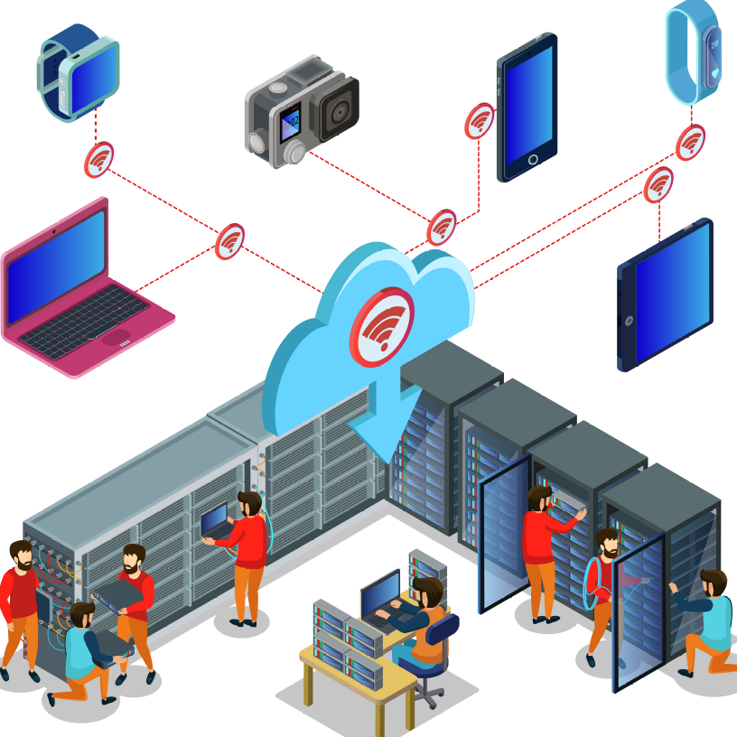
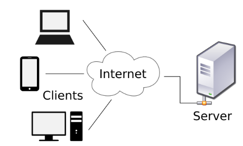
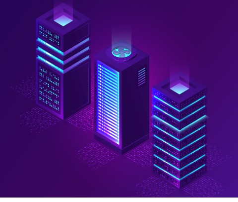

# proj1-dft2.md  

# Project 1, draft 2  

# Serverless Cloud Computing: Where Did the Server Go?  

  
<a href="http://www.freepik.com">Designed by macrovector / Freepik</a>  

Cloud computing has steadily grown since the 90s when internet growth exploded fueled by web applications. Servers are at the core of that growth, delivering a variety of data including email, websites, photos, videos, and other digital content. When you open your browser and link to a website, the web page is delivered by a server.  

The most common applications are based on the classic client-server model that defines the hypertext transfer protocol (HTTP) as the standard communication language between a client application (your browser) and a server application. (See Figure 1.) Servers connect to databases that store the content delivered to the client application. In cloud computing, the cloud is the network of hardware and software based on the client-server model.  

Businesses large and small have invested in servers to run database applications that manage sales, marketing, customer relationships, and production data. Recently, businesses have begun to explore serverless computing.  

## Goodbye server!  

The term "serverless" is misleading. In the client-server architectural style for network-based applications, a server component offers a set of services and listens for requests upon those services. [1] In serverless cloud computing, the client-server model is identical. There is still a client and a server. HTTP is still the communication protocol. What is different you might wonder? In a word, *ownership*.  

Servers require investments in hardware and software. If your business owns one or more servers, you are responsible for purchasing, installing, and configuring the hardware and software. In a serverless environment, a third party assumes ownership of the server hardware and software, including related costs.  

  
[Image by Calimo](https://commons.wikimedia.org/wiki/User:Calimo)  
Figure 1. Classic client-server model  

## Inside the cloud  

Numerous hardware and software components comprise server and serverless environments. The reality is that the hardware and software components could be identical in either environment. The difference is ownership.  

When you own your servers, you are responsible for the hardware, software, costs, and maintenance associated with the server. Cost factors include purchase costs, personnel, configuration, and administration. If you use a cloud provider, your provider is responsible for them.  

**Typical hardware components.** Typical hardware required to implement a server can range in power and complexity. A simplified view of major components can include:  

* Compute engine  
* Storage  
* Network hardware  

**Compute engine.** Compute engines can range from a mainframe computer to a minicomputer to a laptop.  Data centers typically have banks of blade servers that can distribute compute processes among several CPUs. A small business could have a single desktop computer as a local server, whereas large corporations like Facebook or Google have large data centers.  

**Storage.** Applications and data reside on persistent storage devices that typically include magnetic, optical, solid-state disk drives, and/or disk arrays.  

**Networks.** Since we are talking about internet applications, we need network hardware infrastructure that can include switches, routers, load balancers, etc.  

With serverless computing, these hardware components are owned and managed by the cloud provider.  

  
<a href="http://www.freepik.com">Designed by macrovector / Freepik</a>  
Figure 2. Three typical hardware components: Compute engine, storage, and networking.  

## Common cloud services  

By migrating to the cloud, you outsource the hardware, software, and maintenance associated with server ownership. Developers are free to develop applications without the need to consider scaling, disk space, server configuration, and other infrastructure factors into your applications. [2] In addition, you are freeing developers from concerns with hardware and software configuration and capacity.  

**Cloud service types.** There are several types of cloud services, giving you varying degrees of services and control.

**SaaS.** Software as a service (SaaS). As defined by OpenSaaS, "Software-as-a-Service (SaaS) is a software distribution model in which software is licensed on a subscription basis and is centrally hosted. It is sometimes referred to as 'on-demand software'." [3]  

**IaaS.** Infrastructure as a service (IaaS) essentially outsources your on-site IT infrastructure. "IaaS contains the basic building blocks for cloud IT. It typically provides access to networking features, computers (virtual or on dedicated hardware), and data storage space. IaaS gives you the highest level of flexibility and management control over your IT resources." [4] Your provider makes hardware resources (e.g. compute engine, storage, networking) available to you remotely, for a fee, but you control those resources.  

**PaaS.** Platform as a service (PaaS) builds on top of IaaS by shifting the burden of managing your IT resources so you can focus on developing your applications.

## Functions as a service  

Functions as a service (FaaS) is similar to PaaS in that your cloud provider supplies and manages those resources. The main difference is the pay-as-you-go model. You only pay for the resources you use, when you use them, as opposed to paying a fixed fee. Some cloud providers, like AWS and Google, offer FaaS products as their serverless offering.  

Serverless cloud services are developer-friendly because they allow you to scale your applications without regard to capacity. Resources are made available as your application requires and cover a wide range of hardware and software. Typical serverless resources include: 

* Compute service  
* Storage service (e.g. data warehouse data lake, archive)  
* Database service (e.g. relational, column-store, NoSQL)  
* Networking service  
* AI and machine learning  
* Data Analytics  
* Security  

  
<a href="http://www.freepik.com">Designed by stories / Freepik</a>  
Figure 3. Developer focuses on applications, not infrastructure.  

## Two FaaS examples: AWS Lambda and Google Cloud Functions  

Amazon Web Services (AWS) and Google Cloud are two leaders in the serverless market. Both offer serverless products that they describe as FaaS services.  

**AWS Lambda.** "AWS Lambda is a serverless compute service that runs your code in response to events and automatically manages the underlying compute resources for you." [5]  

**Google Cloud Functions.** "Run your code in the cloud with no servers or containers to manage with our scalable, pay-as-you-go functions as a service (FaaS) product." [6]  

**Applications.** Serverless cloud services appeal to developers who want to quickly create code or code snippets without the need to manage server infrastructure and resources. One of the most common uses for FaaS is API development.  

While the focus for developers tends to be on the front end, there are typically backend services that complement FaaS. They are referred to as backend as a service (BaaS). Together, FaaS and BaaS comprise a complete serverless solution. Other applications that leverage serverless cloud services include:  

* Online analytical processing (OLAP)  
* Online transaction processing (OLTP)  
* Artificial intelligence (AI)  
* Machine learning (ML)  
* Security (e.g. OAUTH 2)  

## Summary  

There is always a server in serverless computing, you simply don't need to worry about it. Your cloud service provider takes care of that. Hardware installation and maintenance issues are completely eliminated, allowing you to focus on your core business. If your server needs are unpredictable or may grow over time, serverless computing may be a desirable option for you.  

## References  

[1] Fielding, R., “Architectural Styles and the Design of Network-based Software Architectures”, Doctoral Dissertation, University of California, Irvine, September 2000, https://roy.gbiv.com/pubs/dissertation/top.htm  

[2] AWS, "AWS Cloud Products", https://aws.amazon.com/products/  

[3] OpenSaaS, https://opensaas.org/  

[4] AWS, "Types of Cloud Computing", https://aws.amazon.com/types-of-cloud-computing/  

[5] AWS, "AWS Lambda", https://aws.amazon.com/lambda/  

[6] Google, "Cloud Functions", https://cloud.google.com/functions  

### End 